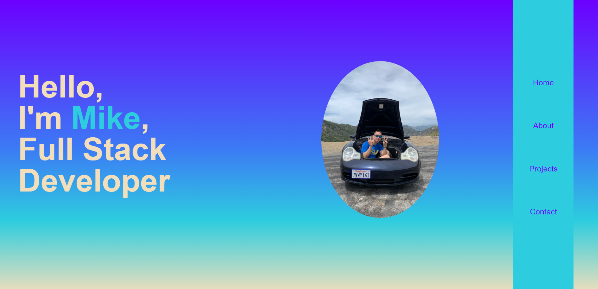
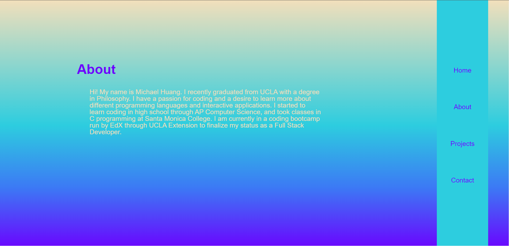
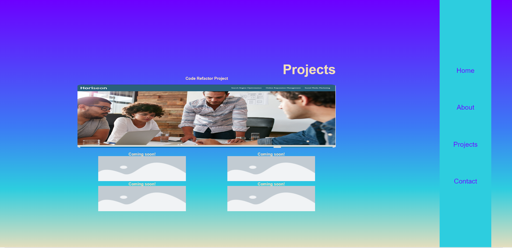
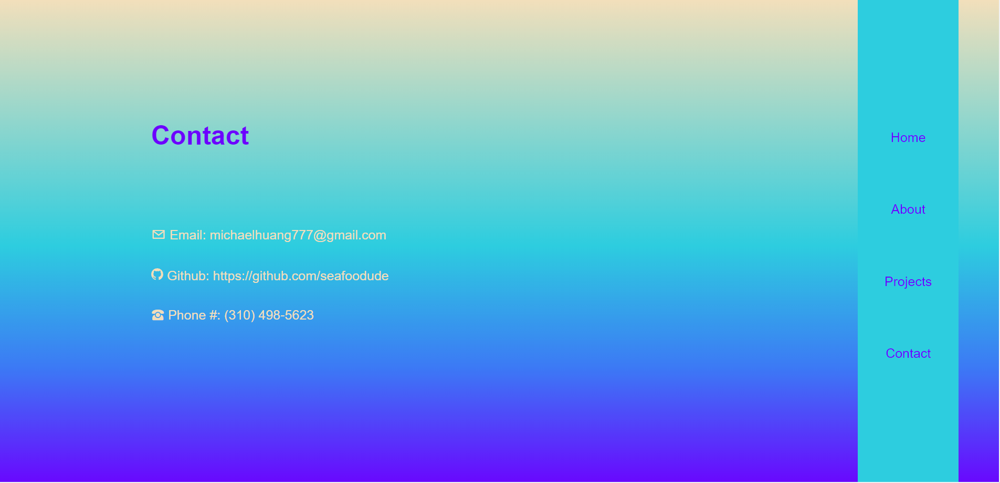

# Homework 2 Portfolio

## Description

This Homework 2 Portfolio was created for boot camp students who were going through Module 02. It contains a portfolio webpage with personal info and previous projects.

My motivation came from my desire to learn advanced CSS and apply it in creating my personal portfolio webpage.
I created this webpage to show that I have learned and absorbed the information given to me through the Module 02 requirement from the UCLA coding bootcamp.
This helped me to achieve a foothold in building more complex and functional webpages in my future projects.
I learned how to build a webpage to display my portfolio and prove my understanding of advanced HTML and CSS.

## Table of Contents 

- [Installation](#installation)
- [Usage](#usage)
- [Credits](#credits)
- [License](#license)

## Installation

N/A

## Usage

To use this Homework 2 Portfolio, you can click on buttons in the navigation bar on the right to take you to sections of the webpage. For suggestions on what to go to first, feel free to start at the About page. It will take you to the section with my bio. Projects contains my previous work that I felt proud of.

**NOTE**: This webpage is meant for desktop viewing. It does shrink at the 768px mark, but it looks terrible. It is only meant to be functional.

**SCREENSHOTS**

## Credits

N/A

## License

Please refer to the LICENSE in the repo.